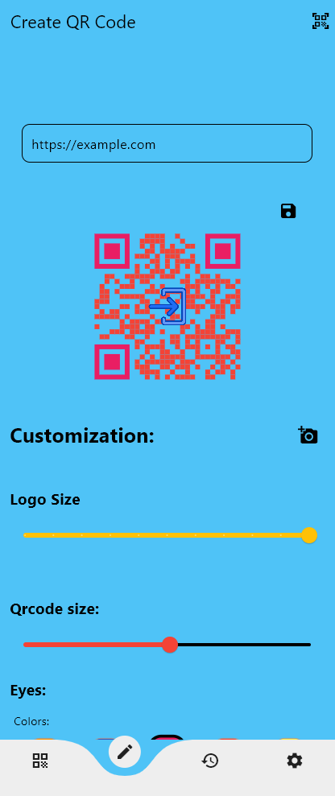

do not forget to star ⭐🌟⭐


**QRme**  is a mobile application that allows users to scan, decode, and generate QR codes easily and efficiently.

do not forget to star ⭐🌟⭐

Download the App here:

[](https://github.com/Touti-Sudo/QRme/releases/download/V1.0.0/app-release.apk)


---

## ✨ Features

* Fast QR Code Scanner
* QR Code Generator
* User-Friendly Interface
* Copy & Paste Support
* Share with Friends
* No Internet Required

---

## 🧱 Built With

* [Flutter](https://flutter.dev/)
* `path_provider` for state management
* `mobile_scanner` for scanning qr codes
* `pretty_qr_code` for creating qr codes
* `url_launcher` to launch the urls
* `screenshot` 
* `share_plus` to share bettween friends

---

## 📸 Screenshots
### Scan Page


### Creat Page

---

## 🚀 Getting Started

### Prerequisites

* Flutter SDK (>= 3.0.0)
* Android/iOS setup

### Installation

1. Clone the repo:

```bash
git clone https://github.com/Touti-Sudo/QRme.git
cd QRme
```

2. Install dependencies:

```bash
flutter pub get
```


3. Run the app:

```bash
flutter run
```

## 📂 Project Structure

```
lib/
├── assets/
│   │── icon.png
├── pages/
│   │── qr_render_page.dart
│   │── scan_page.dart
└── main.dart
```

---

## 🤝 Contributing

Pull requests are welcome. For major changes, please open an issue first.

---

## 📄 License

This project is licensed under the GPL License. See the [LICENSE](LICENSE) file for details.

---

## 📬 Contact

* Developer: Anes
* Linkedin: Kada Anes
* GitHub: @Touti-Sudo

---

Enjoy Scanning with QRme!
